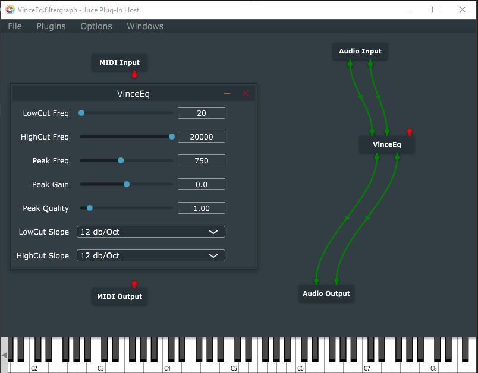

# Equalizer

### A standalone and vst3 equalizer plugin built using JUCE Framework

Screenshot of the vst3 plugin hosted by Juce's Audio plugin host.

# Getting Started

> Recommend virtual audio cable (windows) for the audio input.

1. Clone the repository (if you haven't already!), and navigate to the `juceq` folder.

2. Open the project in CLion (highly recommended), the cmake files will clone the juce framework and setup the whole project automagically.

3. Alternatively using visual studio code, install C/C++, CMake and CMakeTools extensions, then build.

## Download Release
Head on over to https://github.com/mrdvince/juceq/releases

Under assets download either the vst3(needs audio plugin host for testing or scan and add it to Fl Studio) then test it.

For the stand alone plugin, just run it, configure audio settings and voila
